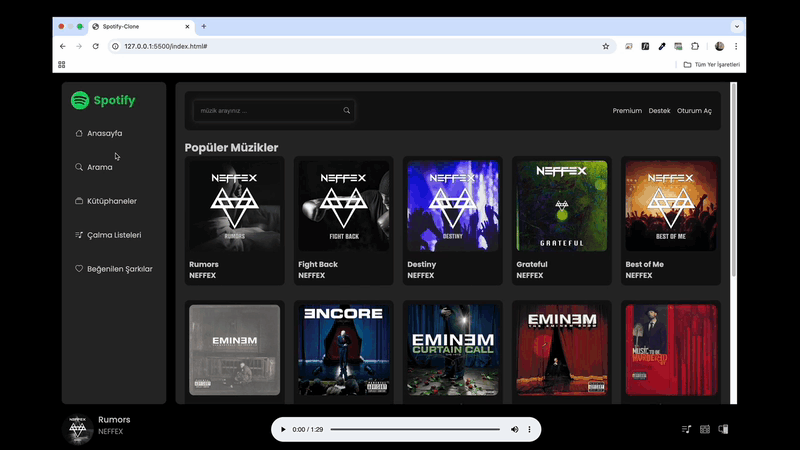

# Spotify-Clone 🎶

<li>Bu proje HTML5,CSS,SCSS,JS,API ile oluşturulmuş Spotify Clone arayüzü içerir.</li>
<li>Api'den gelen verilerle şarkı listeleme,arama,oynatma özelliklerini barındırır.</li>
<li>Kullanıcı dostu arayüzü,duyarlı tasarımı ile kolay erişim olanağı sunar.</li>

# Kullanılan Teknolojiler 🎨

<li>HTML5</li>
<li>CSS</li>
<li>SCSS</li>
<li>JS</li>
<li>API</li>
<li>RESPONSİVE</li>

# Ekran Görüntüsü 🎥
      

# İletişim 📩
yunusemreoral@hotmail.com.tr

